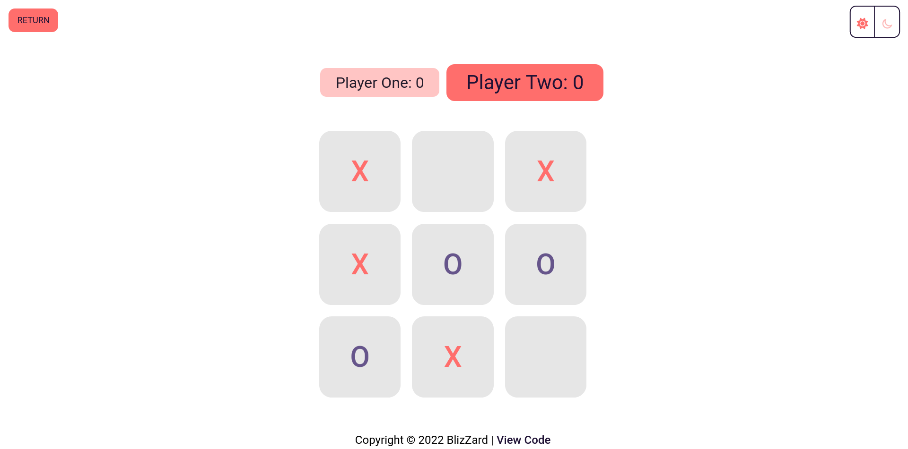

# Tic Tac Toe

A 2-player version of tic-tac-toe played in the browser

The live version of this project can be found [here](https://BlizZard-bot.github.io/tic-tac-toe/)

Learn how to play the game [here](https://en.wikipedia.org/wiki/Tic-tac-toe)

## Learnings

## The Plan:

Tic tac toe has 3 main parts:

- The players and their markers - There are two players, each with their specific marker(x or o), specific type (player or bot) and specific score. Get the values of the markers and type of player through the buttons on the homepage. Generate players using a factory function

- Gameboard- Main module working with the entire game. First off create a gameboard array with indexes corresponding to specific data-attributes on the cells of the grid. Then pass over to the display after each click on the cell.
  Also, stop all events when a win(a horizontal, vertical or diagonal cross of the same marker) or a draw happens.

- Display - Another module updating the display with the required markers and changing the markers after each click. Also, prevent players from placing markers where they are already placed.

#### Win conditions:

3 horizontal, 3 vertical and 2 diagonal conditions are possible for wins

All visual representations of win conditions are for X

###### Horizontal

            1        2       3
          x x x    o x o   o x o
          o x o    x x x   o x o
          o o x    o x o   x x x

Indices for the 3 cases:

1. 0 1 2
2. 3 4 5
3. 6 7 8

All indices for a particular situation are consecutive and each situation differs from the other by 3

###### Vertical

            1        2       3
          x o x    o x o   x o o
          o x x    x x x   x o o
          o o x    o x o   x x x

Indices for the 3 cases:

1. 2 5 8
2. 1 4 7
3. 0 3 6

All indices for a particular situation differ from each other by 3 and each situation differs from the other by 1

###### Diagonal

          Left     Right
          x o x    o x x
          o x x    x x o
          o o x    x x o

Indices for the 2 cases:

Left: 0 4 8

Right: 2 4 7

There is no pattern between indices

##### Plan for Bot moves

First check if first player is bot. If its a bot then show marker immediately. If it isn't, then add a function inside the main event listener after the player's turn to instantly add a marker.
Else if both are bots then, continue the game till one of them loses or wins

### Minimax Algorithm

The minimax algorithm works by calculating the best move by working backwards from the end of the game. It assumes that player one is trying to **maximize their chances of winning** while player two is trying to **minimize their chances of losing**. For example, if player one can win in one move, their best move is that move. If player two knows that there's a move which results in player one winning in one move, while another move will lead to a draw at best, its best move is the one which results in a draw.

The turn taking player would want to pick the move with the maximum score. However, the scores for the moves are determined by the opposing player deciding which move has the minimum score.
So, the basic idea would look like:

- If it's a game win, return the score from the currentPlayer(score should be 10-depth for win and depth-10 for loss)
- Otherwise get all the possible situations for every move
- Create a scores array and a moves array
- For each situation, add the score to the array and the move to the moves array
- If it's currentPlayer's win get the maximum score
- Otherwise, get the minimum score

#### Minimax Scenario

Let us consider this scenario (we are ignoring the depth here):

- It's X's turn in 1
- X places its marker at different positions in 2,3 and 4
- X immediately wins in 2 so pushes +10 to the array
- 3 and 4 are not in end states, so 3 generates 5 and 6 and calls minimax on them, while 4 generates 7 and 8 and calls minimax on them.
- 5 pushes a score of -10 onto 3's score array, while the same happens for 7 which pushes a score of -10 onto 4's score array.
- 6 and 8 generate the only available moves, which are end , and so both of them add the score of +10 to the move arrays of 3 and 4.
- Because it is O's turn in both 3 and 4, O will seek to find the minimum score, and given the choice between -10 and +10, both 3 and 4 will yield -10.
- Finally the score array for 2, 3, and 4 are populated with +10, -10 and -10 respectively, and 1 seeking to maximize the score will chose the winning move with score +10, 2.

## Credit

The image for the minimax situation was taken from [this blog post](https://www.neverstopbuilding.com/blog/minimax)

The main design was inspired by [TheOnlyHamster](https://theonlyhamstertoh.github.io/tictactoe/)
